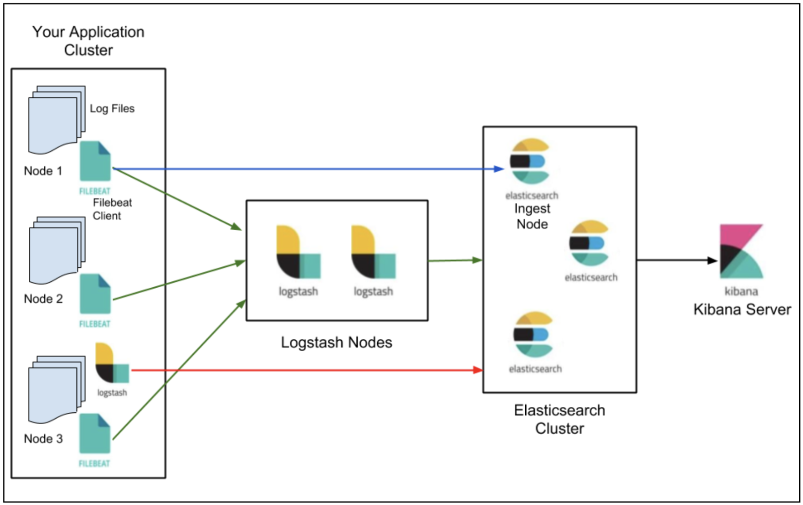
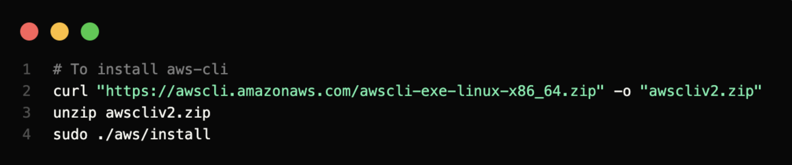
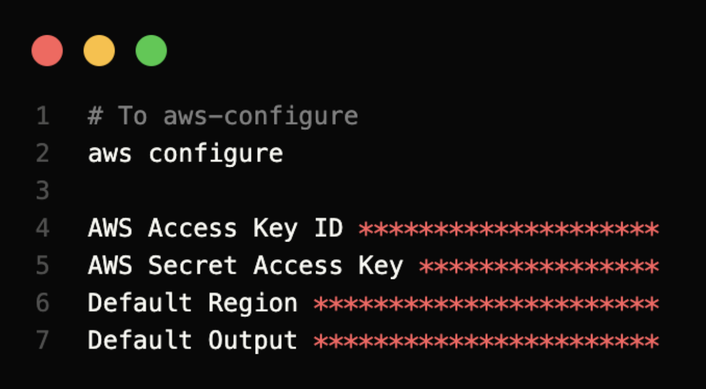
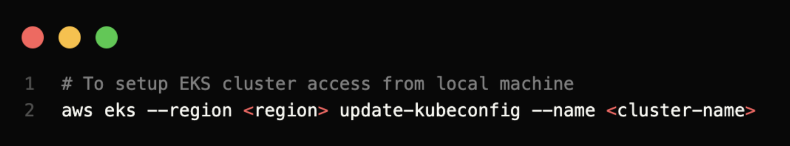
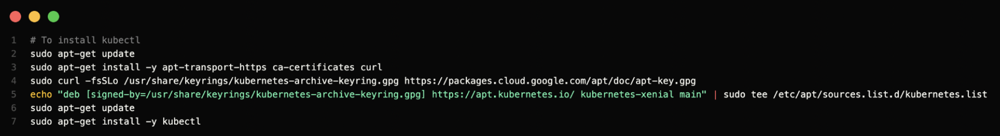
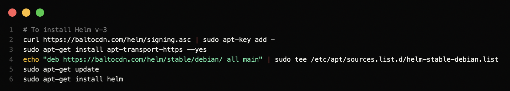
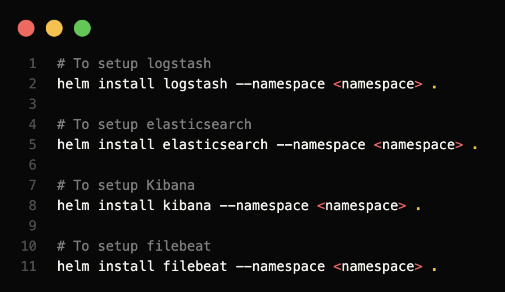
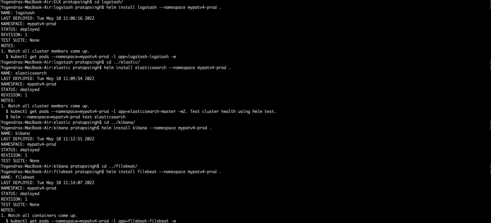
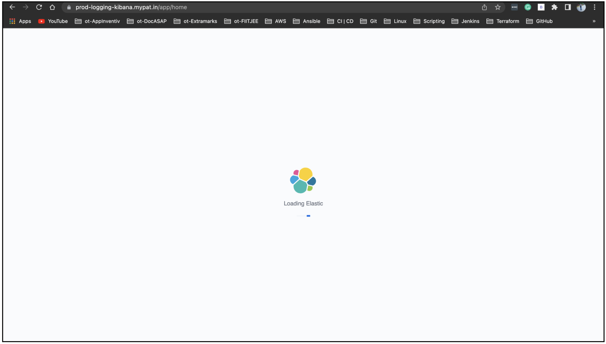
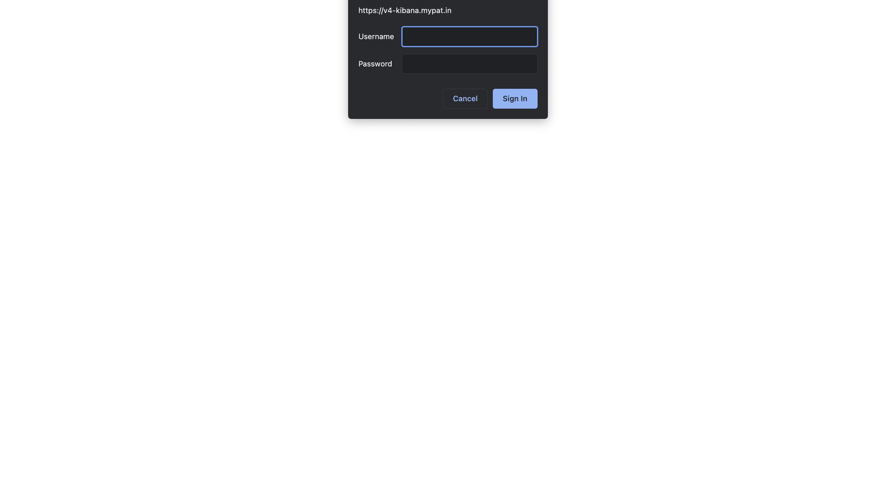

# ELK + Filebeat


## Requirement
Setup a centralized logging system which helps to visualize logs from multiple nodes of kubernetes applications on a single Platform.

## Prerequisite 
-   aws-cli
-   aws-configure
-   EKS cluster access
-   Kubectl
-   Helm v3




### Use cases of each component
**Filebeat -** Generally, the beats family are open-source lightweight data shippers that you install as agents on your servers to send operational data to Elasticsearch. Beats can send data directly to Elasticsearch or via Logstash, where you can further process and enhance the data (image). 
Filebeat helps keep things simple by offering a lightweight way (low memory footprint) to forward and centralize logs and files, making the use of SSH unnecessary when you have a number of servers, virtual machines, and containers that generate logs. Other benefits of Filebeat are the ability to handle large bulks of data, and deal efficiently with backpressure. Essentially, Filebeat is a logging agent installed on the machine generating the log files, tailing them, and forwarding the data to either Logstash for more advanced processing or directly into Elasticsearch for indexing.

**Logstash -** It pulls and receives the data from multiple systems, transforming it into a meaningful set of fields and eventually streaming the output to a defined destination for storage.

### Why should we use Filebeat and Logstash in tandem?
-   Even though Filebeat can directly forward logs to ES, the use of a combination of Filebeat and Logstash is recommended because otherwise, only timestamp and message fields will be visible. Logstash is required for the “T” in **ETL** (Transformation) and to act as an aggregator for multiple logging pipelines.

-   Filebeat does not offer **grok** (Grok is a way to parse unstructured log data into something structured and queryable) filtering method (combining text patterns into something that matches the logs).

-   Logstash requires a JVM to run that causes significant memory consumption. Hence, running it on every system is not feasible.

Therefore, Filebeat would act as a lightweight agent deployed on the edge host, pumping data into Logstash for aggregation, filtering and enrichment.

### Setup Prerequisite 

-   aws-cli

    

    Click here to get more information to download [aws-cli](https://docs.aws.amazon.com/cli/latest/userguide/getting-started-install.html).

-   aws-configure

    

    Click here to get more information to set up [aws configure](https://docs.aws.amazon.com/cli/latest/reference/) .


-   EKS cluster access

    

    Click here to get more information about [EKS-access](https://aws.amazon.com/premiumsupport/knowledge-center/amazon-eks-cluster-access/).

-   Install kubectl

    

    Click here to get more information to download [kubectl](https://kubernetes.io/docs/tasks/tools/install-kubectl-linux/).

-   Helm v3

    

    Click here to get more information to download the [helm](https://helm.sh/docs/intro/install/).


## Let’s see how to setup ELK + Filebeat

*Note-: You must  be in that directory where the helm-chart is.*



Output should be like below



Create Kibana service file to access from URL

```yaml
---
apiVersion: extensions/v1beta1
kind: Ingress
metadata:
  name: ingress-name
  namespace: default
  annotations:
    kubernetes.io/ingress.class: alb
    alb.ingress.kubernetes.io/certificate-arn: "certificate-arn"
    alb.ingress.kubernetes.io/listen-ports: '[{"HTTP":80},{"HTTPS":443}]'
    alb.ingress.kubernetes.io/scheme: internet-facing
    alb.ingress.kubernetes.io/subnets: list-of-subnets
    alb.ingress.kubernetes.io/actions.ssl-redirect: '{"Type": "redirect", "RedirectConfig": { "Protocol": "HTTPS", "Port": "443", "StatusCode": "HTTP_301"}}'
    alb.ingress.kubernetes.io/actions.authors-redirection: '{"Type":"redirect","RedirectConfig":{"Host":"authors.glorifire.com","Port":"443","Protocol":"HTTPS","Query":"#{query}","StatusCode":"HTTP_301"}}'

spec:
  rules:
    - host: prod-logging-kibana.mypat.in
      http:
        paths:
        - path: /*
          backend:
            serviceName: elk-nginx
            servicePort: 8080
```

Access Kibana from browser
    

## Setup authentication using Nginx

Create a Dockerfile for Nginx setup along with apache2-utils setup

```Dockerfile
FROM nginx:1.19

# Install apache2-utils to get htpasswd command
RUN apt-get update -y && apt-get install -y apache2-utils && rm -rf /var/lib/apt/lists/*

# Basic auth credentials
ENV BASIC_USERNAME=username
ENV BASIC_PASSWORD=password

# Forward host and foward port as env variables
# google.com is used as a placeholder, to be replaced using environment variables
ENV FORWARD_HOST=google.com
ENV FORWARD_PORT=80

# Nginx config file
WORKDIR /
COPY nginx-basic-auth.conf nginx-basic-auth.conf

# Startup script
COPY run.sh ./
RUN chmod 0755 ./run.sh
CMD [ "./run.sh" ]
```

Add a bash script which helps to generate password

```bash
#!/bin/sh

# nginx config variable injection
envsubst < nginx-basic-auth.conf > /etc/nginx/conf.d/default.conf

# htpasswd for basic authentication
htpasswd -c -b /etc/nginx/.htpasswd admin kibana@mypat

nginx -g "daemon off;"
```

Add a nginx-conf file to redirect from kibana service

```conf
server {
    listen 8080 default_server;

    location / {
        auth_basic             "Restricted";
        auth_basic_user_file   .htpasswd;

        proxy_pass             http://kibana-kibana:5601;
        proxy_read_timeout     900;
    }
}
```

Launch above nginx pod

```yaml
---
apiVersion: apps/v1
kind: Deployment
metadata:
  name: elk-nginx
  namespace: default
spec:
  replicas: 1
  selector:
    matchLabels:
      app: elk-nginx
  template:
    metadata:
      labels:
        app: elk-nginx
    spec:
      containers:
      - name: nginx
        image: imageURL
        imagePullPolicy: Always
        ports:
        - containerPort: 8080

---
apiVersion: v1
kind: Service
metadata:
  name: elk-nginx
  namespace: default
spec:
  type: NodePort
  ports:
  - port: 8080
    targetPort: 8080
  selector:
    app: elk-nginx
```

## Access Kibana with Auth




### Contributors
[![Yogendra Pratap Singh][yogendra_avatar]][yogendra_homepage]<br/>[Yogendra Pratap Singh][yogendra_homepage] 

  [yogendra_homepage]: https://github.com/PratapSingh13
  [yogendra_avatar]: https://img.cloudposse.com/75x75/https://github.com/PratapSingh13.png

